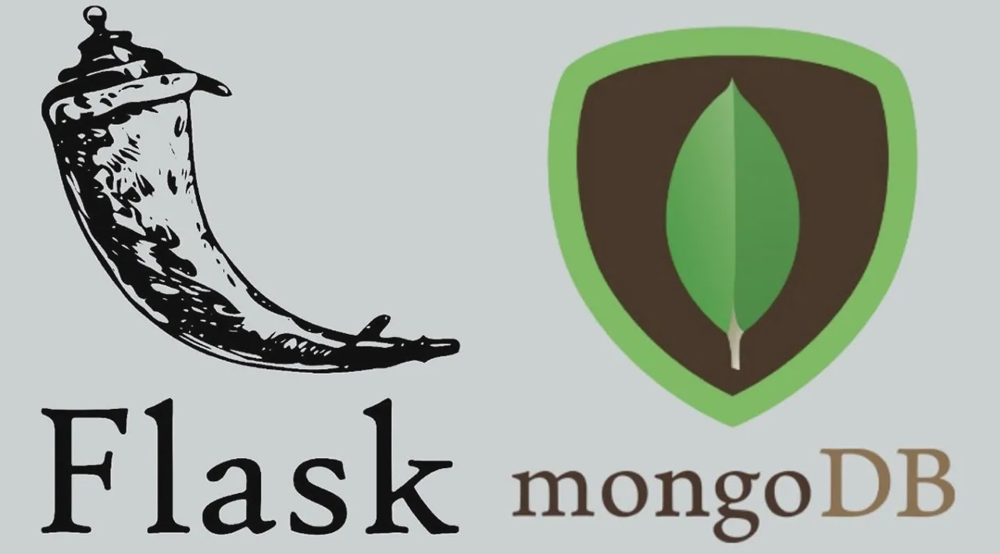

# restapi-python-flask-mysql
This is a example of a Python application providing a REST API of Sales.
<!-- PROJECT LOGO -->
<br />
<p align="center">
  <a href="https://github.com/felipe-parra/restapi-python-flask-mysql.git/">
    
  </a>

  <h3 align="center">Sales API</h3>

  <p align="center">
    An awesome REST API of Sales!
    <br />
    <a href="https://github.com/felipe-parra/restapi-python-flask-mysql.git"><strong>Explore the docs »</strong></a>
    <br />
    <br />
    <a href="https://github.com/felipe-parra/restapi-python-flask-mysql.git">View Demo</a>
    ·
    <a href="https://github.com/felipe-parra/restapi-python-flask-mysql.git/issues">Report Bug</a>
    ·
    <a href="https://github.com/felipe-parra/restapi-python-flask-mysql.git/issues">Request Feature</a>
  </p>
</p>

## Getting Started
To get a local copy up and running follow these simple example steps.

### Prerequisites

You need to have already installed python and virtual enviroment activated
  
### Installation

1. Clone the repo
    ```sh
    git clone git@github.com:felipe-parra/restapi-python-flask-mysql.git
    ```

2. Install NPM packages
    ```
    pip install -r requirements.txt
    ```

3. Create your environment variables file `config.py`
    ```ENV
    _SECRET_KEY_APP=<SECRET_KEY_APP>
    _MYSQL_HOST=<_MYSQL_HOST>
    _MYSQL_USER=<MYSQL_USER>
    _MYSQL_PASSWORD=<MYSQL_PASSWORD>
    _MYSQL_DB=<MYSQL_DB>
    ```

4. Run project
    ```sh
    python src/app.py
    ```

<!-- CONTRIBUTING -->
## Contributing

Contributions are what make the open source community such an amazing place to learn, inspire, and create. Any contributions you make are **greatly appreciated**.

1. Fork the Project
2. Create your Feature Branch (`git checkout -b feature/AmazingFeature`)
3. Commit your Changes (`git commit -m 'Add some AmazingFeature'`)
4. Push to the Branch (`git push origin feature/AmazingFeature`)
5. Open a Pull Request


## License

Distributed under the MIT License. See `LICENSE` for more information.


<!-- CONTACT -->
## Contact

Felipe Parra - [@__felipeparra_](https://twitter.com/_felipeparra)

Project Link: [https://github.com/felipe-parra/restapi-python-flask-mysql.git](https://github.com/felipe-parra/restapi-python-flask-mysql.git)

